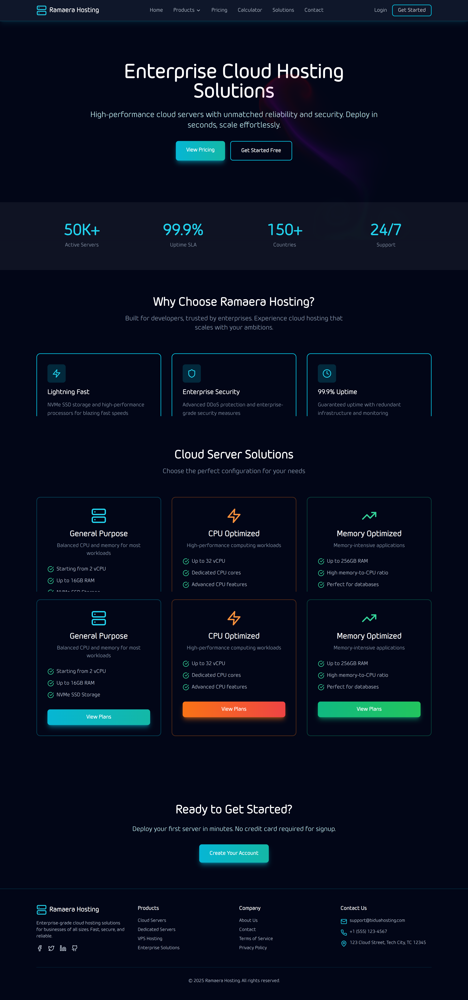

# 📦 Project Name — Ramaera Hosting services

A modern **monorepo** containing:

- ⚡ **FastAPI backend**
- 🌐 **ReactJS frontend**
- 🐘 **PostgreSQL database**
- 🐳 **Docker & Docker Compose support**
- 🔐 JWT authentication
- 💳 Razorpay integration
- 📧 SMTP email support

This setup is ideal for production-ready full-stack applications.

---

## 🚀 Tech Stack

### **Backend (FastAPI)**
- FastAPI
- SQLAlchemy / Asyncpg
- Alembic migrations
- JWT Authentication

### **Frontend (React)**
- React + Vite (or CRA)
- Axios
- Zustand / Redux (optional)

### **Database**
- PostgreSQL 16.10

### **DevOps**
- Docker & Docker Compose
- Environment variable management
- Monorepo structure

---

# 📂 Monorepo Folder Structure

root/
│
├── hostingbackend/
│ ├── app/
│ ├── migrations/
│ ├── Dockerfile
│ ├── requirements.txt
│ └── .env.example
│
├── hostingfrontend/
│ ├── src/
│ ├── public/
│ ├── package.json
│ └── .env.example
│
├── docker-compose.yml
├── README.md
└── .gitignore

yaml
Copy code

---

# ⚙️ Setup Instructions

## 1️⃣ Clone the Repo

```bash
git clone https://github.com/abhishekrajput1235/ramaera-hosting-mono-repo.git
cd YOUR_REPO
🔧 Environment Variables
Both frontend and backend include .env.example.

Copy and rename them:

bash
Copy code
cp backend/.env.example backend/.env
cp frontend/.env.example frontend/.env
Fill in the required values.

🐳 Run with Docker (Recommended)
Check Docker installation:

bash
Copy code
docker --version
Start all services:

bash
Copy code
docker compose up --build
Services Available
Service	URL
FastAPI Backend	http://localhost:8000
React Frontend	http://localhost:5000
PostgreSQL DB	localhost:5432

▶️ Manual Setup (Without Docker)
🟦 Backend (FastAPI)
Install dependencies
bash
Copy code
cd backend
pip install -r requirements.txt
Run FastAPI
bash
Copy code
uvicorn app.main:app --reload
Visit backend:
👉 http://localhost:8000

🟩 Frontend (React)
bash
Copy code
cd frontend
npm install
npm run dev
Visit frontend:
👉 http://localhost:5000

🔒 Authentication
JWT-based login

Secret Key from .env

Token expiration support

💳 Razorpay Integration
Add Razorpay keys in backend .env:

ini
Copy code
RAZORPAY_KEY_ID=your_key
RAZORPAY_KEY_SECRET=your_secret
📧 Email Notifications
Configure SMTP settings in backend .env:

makefile
Copy code
SMTP_HOST=
SMTP_PORT=
SMTP_USER=
SMTP_PASSWORD=
🛠️ Docker Compose Overview
Includes the following services:

backend (FastAPI)

frontend (React)

db (PostgreSQL 13)

Persistent volume:

nginx
Copy code
postgres_data
🧪 API Documentation
FastAPI provides automatic API docs:

Swagger → http://localhost:8000/docs

ReDoc → http://localhost:8000/redoc

📄 .env.example Included
Both backend and frontend include a safe .env.example file.

🤝 Contributing
Pull requests are welcome.

Follow commit message convention:

pgsql
Copy code
feat: add login API
fix: correct database URI
chore: update dependencies
📄 License
This project is licensed under the MIT License.

⭐ Support
If you like this project, please leave a ⭐ star on GitHub!

yaml
Copy code

----

If you want, I can also generate:

✅ Badges (Docker, Build, MIT License, Stars)  
✅ System Architecture Diagram  
✅ API examples section  
✅ Screenshots template  

Just tell me!


🌍 Live Demo

🚀 Production App:
👉 https://ramaerahosting.com/

📸 Screenshots

Add your actual screenshots inside:
/assets/screenshots/ or /public/screenshots/

Here is the markdown structure 👇

## 📸 Screenshots

### 🏠 Homepage


### 🖥️ Dashboard


### ADMIN Dashboard

